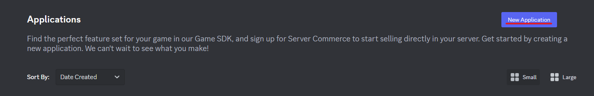
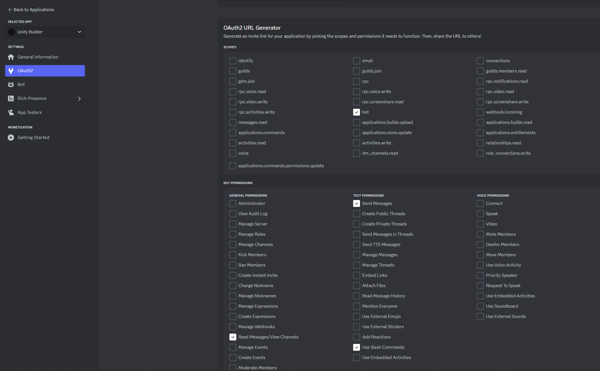
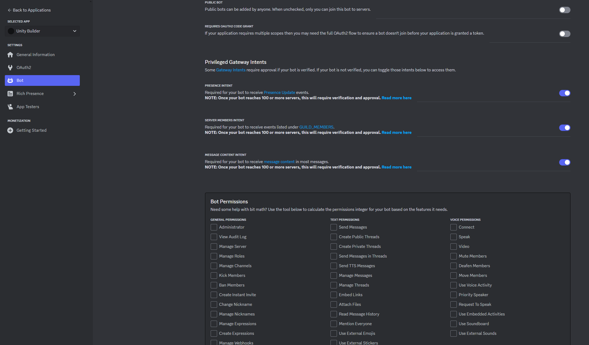

# UnityBuilderDiscordBot

This is a Discord DevOps bot helps everyone (no matter whether he or she is programmer or not) build the Unity game
executables and hot updates.

Developed by Shepherd Zhu (@Shepherd0619). **Under BSD 3-Clause License.**

To contribute, please submit a pull request.

PLEASE NOTICE THAT THIS BOT IS JUST A TEMPLATE. YOU SHOULD FORK IT AND MODIFY IT TO SUIT YOUR PROJECT'S NEEDS.

For the hot update part, please refer to [JenkinsBuildUnity](https://github.com/Shepherd0619/JenkinsBuildUnity).

## Features

1. Build Unity executables and hot updates via Slash Command and send the feedback to specific channel.
2. Upload hot updates via SFTP.
3. Auto SourceControl (git, cm) fetch/pull/reset.
4. Customize build action via JSON. **(Work in progress)**

## How to use

1. Visit https://discord.com/developers/applications and create an application.



2. Generate OAuth2 URL (with permissions assigned) and visit it to invite the bot into your server.



3. Enable all Privileged Gateway Intents.



4. Generate appsettings.json.

```json
{
  "Discord": {
    "token": "your-bot-token",
    "channel": "your-channel-id",
    "logChannel": "your-bot-log-channel-id (leave it empty if you dont want log. )"
  },
  "Unity": [
    {
      "2022.3.14f1": "E:\\Program Files\\Unity 2022.3.14f1\\Editor\\Unity.exe"
    }
  ],
  "Projects": [
    {
      "name": "example",
      "path": "D:\\Unity_Projects\\example",
      "unityVersion": "2022.3.14f1",
      "playerBuildOutput": "D:\\Unity_Projects\\example\\Build",
      "addressableBuildOutput": "D:\\Unity_Projects\\example\\ServerData",
      "sourceControl": "git",
      "branch": "develop",
      "notificationChannel": "",
      "ssh": {
        "address": "",
        "user": "",
        "password": "",
        "privateKeyPath": "",
        "keepAliveInterval": "-1",
        "expectedFingerprints": []
      },
      "deployment": {
        "SftpUploadAction": {
          "LocalPath": "D:\\Unity_Projects\\example\\ServerData",
          "RemotePath": "/var/www/html/ServerData"
        }
      }
    }
  ]
}
```

5. Run UnityBuilderDiscordBot.exe (for Windows) or UnityBuilderDiscordBot.dll (for Linux).

6. Type "/" to see available commands.